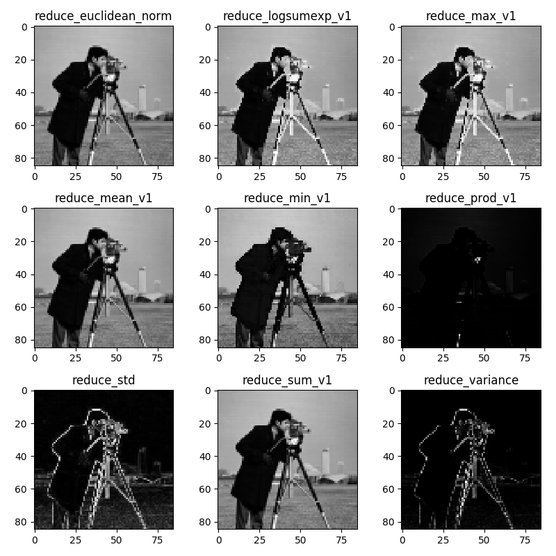

# KerasCustomLayers
A set of custom keras layers for experimentation

## CustomPooling.py
This file contains a class UniPooling.
This class implements pooling layer with easily
customizable method of pooling. Tensorflow has only two
built-in pooling methods, MAX and AVERAGE, while here
any function, implementing mapping from NxM image patch
to a scalar is valid, nevertheless the most convenient
are function tf.math.reduce* which could be used directly.  

Current version of tensorflow supports:

    K.tf.math.reduce_euclidean_norm
    K.tf.math.reduce_logsumexp
    K.tf.math.reduce_max
    K.tf.math.reduce_meam
    K.tf.math.reduce_min
    K.tf.math.reduce_prod
    K.tf.math.reduce_std - will not work if negative values are present
    K.tf.math.reduce_sum
    K.tf.math.reduce_variance

### Usage

As normal pooling layer with additional parameter reduce_function, e.g.
```python
model.add(UniPooling2D(pool_size=(2, 2), strides=(3, 3), reduce_function=K.tf.math.reduce_min))
```

